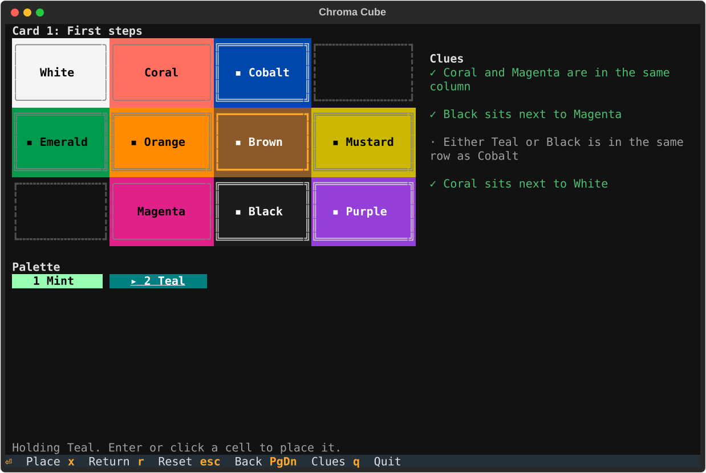

# Chroma Cube

A digital version of **Chroma Cube**, the single-player color-cube deduction puzzle:
twelve colored cubes, a 3×4 tray, and a card of clues that pins down where every cube goes.

This project goes further than the physical game:

- a **clue language** that models every relationship a clue can express,
- a **solver** that checks any puzzle is solvable (and whether its answer is unique),
- a **generator** that produces endless new, verified puzzles,
- a terminal UI (Textual) you can also serve in a browser.

## Play



Try it without installing anything permanent (needs [uv](https://docs.astral.sh/uv/)):

```bash
uvx --from git+https://github.com/tchoffman/chroma-cube chroma-cube
```

Or install the `chroma-cube` command:

```bash
uv tool install git+https://github.com/tchoffman/chroma-cube
chroma-cube
```

Each tagged [release](https://github.com/tchoffman/chroma-cube/releases) also carries a wheel
you can install with `uv tool install <wheel file>` or `pip install <wheel file>`.

Pick a card from the list, then fill the tray so every clue holds. Each clue shows `·` (not
decided yet), `✓` (holds) or `✗` (broken) as you go. Cubes with a double border and a `▪`
are given and cannot move.

| Key | Does |
|---|---|
| a letter | take the next palette cube with that first letter (`m` cycles Magenta, Mint, Mustard) |
| `1`-`9`, `0` | take the palette cube at that place in the strip (`0` is the tenth) |
| arrows | move the cursor over the tray |
| `Enter` / `Space` | on the cursor cell: place the held cube, pick up a placed cube, swap, or put it back down |
| `x` / `Backspace` / `Delete` | send the held cube (or the one under the cursor) back to the palette |
| `r` | reset the card |
| `PageUp` / `PageDown` | scroll the clues |
| `Escape` | let go of the held cube; with nothing held, back to the card list |
| `q` | quit |

Mouse: click a palette cube, then a cell. Click a placed cube to pick it up, then another
cell to move it (onto a placed cube swaps them). The mouse wheel scrolls the clues.

### In a browser

Install with the `web` extra and pass `--serve`:

```bash
uv tool install 'chroma-cube[web] @ git+https://github.com/tchoffman/chroma-cube'
chroma-cube --serve                 # this machine only: http://127.0.0.1:8000
```

Every browser tab gets its own game. In a checkout, `uv sync --extra web` then
`uv run chroma-cube --serve` does the same.

To play from another device, bind to this machine's address on your network (here
`192.168.1.20`) and open that address on the other device:

```bash
chroma-cube --serve --host 192.168.1.20 --port 9000   # http://192.168.1.20:9000
```

The page connects back to the server at the address it was served on, so `--host 0.0.0.0`
alone gives a page that never connects. If you must bind to every interface (or sit behind
a proxy), also give the address browsers use:

```bash
chroma-cube --serve --host 0.0.0.0 --port 9000 --public-url http://192.168.1.20:9000
```

The server has no login, so only open it on a network you trust.

## How it works

- [docs/GAME.md](docs/GAME.md): the rules of the physical game this follows.
- [docs/CLUE_LANGUAGE.md](docs/CLUE_LANGUAGE.md): how a clue is modelled, checked and
  turned back into a sentence.
- [docs/DECISIONS.md](docs/DECISIONS.md): every design call and what it gave up.

## Develop

```bash
uv sync --all-groups
uv run pytest -q
uv run ruff check . && uv run ruff format --check . && uv run mypy
```

Design decisions are recorded in [docs/DECISIONS.md](docs/DECISIONS.md).
Feature work is tracked in GitHub Issues.
